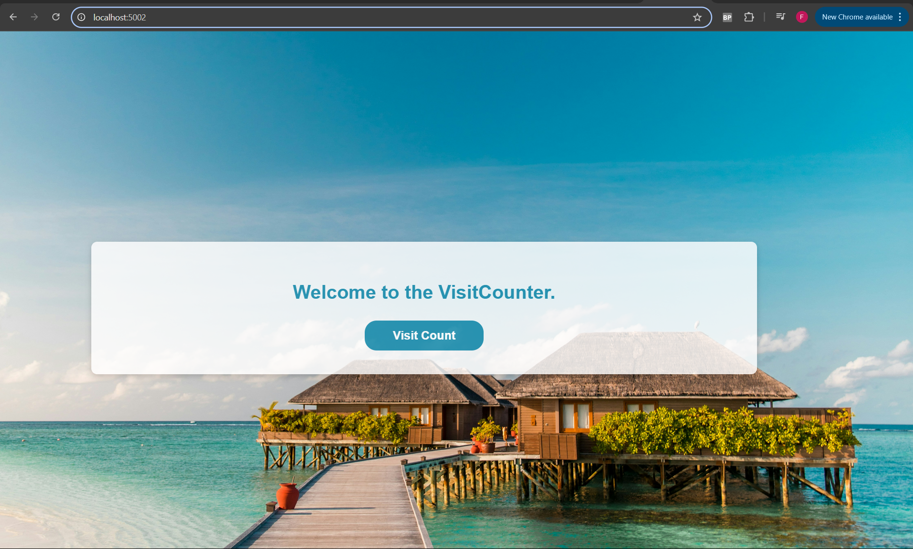
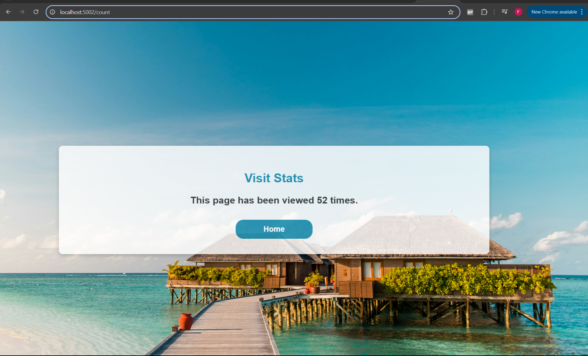
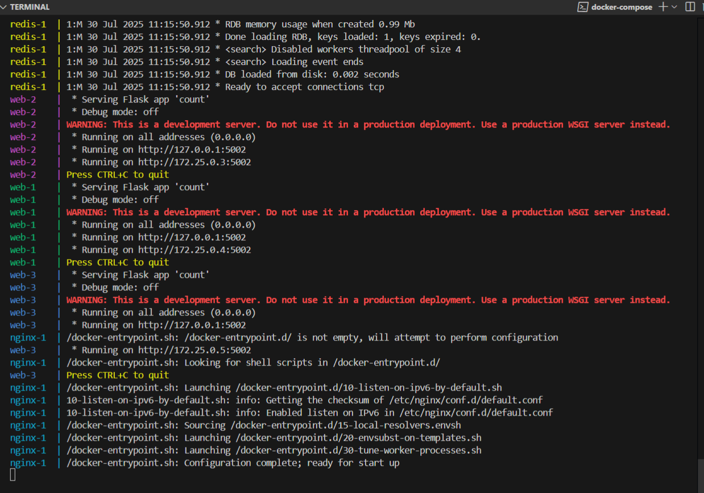

# Multi-Container Application

## 📄 Project Description

This is a multi-container web application built with Python Flask and Redis, managed using Docker Compose. The Flask app tracks page visits and stores the count in Redis. To ensure data persists even when the Redis container is stopped or removed, a Docker volume is mounted to Redis.

The Flask application reads Redis connection details (host and port) from environment variables, promoting flexibility and easier configuration across environments without modifying source code.

For scalability, the Flask service is run in multiple instances, with NGINX acting as a reverse proxy to load balance traffic between them.

---

## 📁 Docker Counter Project Structure

```


docker-counter-project/
├── counter/
│   ├── static/
│   │   ├── css/
│   │   │   └── index.css
│   │   └── images/
│   │       └── index-bg.jpg
│   ├── templates/
│   │   ├── count.html
│   │   └── index.html
│   ├── count.py
│   ├── docker-compose.yml
│   ├── Dockerfile
│   └── nginx.conf
├── images/
│   ├── counter-app-1.png
│   ├── counter-app-2.png
│   └── docker-compose-pic.png
└── README.md


```

---



---



---

# Dockerfile, images and containers

### Dockerfile

A Dockerfile provides instructions to build a container image. In this project, a Dockerfile was created for the Flask app. No Dockerfiles were created for Redis or NGINX as the official images from Docker Hub were used for both Redis and NGINX. Docker builds images by reading the instructions from a Dockerfile.

### Images

A container image contains everything you need to run a container such as files, binaries, libraries, and configurations to run a container. Images are immutable. Once an image is created, it cannot be modified. You can only make a new image or add changes on top of it. In terms of this project, the web service (Flask app) is using an image that was built with the help of the `Dockerfile` that you can find in the same directory as the `docker-compose.yml` file.

However, the Redis service used the official Redis image from Docker Hub, Redis:latest.

Furthermore, the NGINX service used the NGINX:latest image from Docker Hub.

### Containers

Containers are isolated processes for each of your app's components. In this project, the Flask app (web service), Redis(database) and NGINX (reverse proxy/load balancer) each run in their own isolated environment, completely isolated from everyting else on your machine. The Flask app (web service) can also be scaled, and in that case multiple containers will be running as part of the web service to handle increased traffic or ensure high availability.

---

# Docker-compose.yml file

```
version: "3.8"

services:
  web:
    build: .
    expose:
      - "5002"
    depends_on:
      - redis
    environment:
      - REDIS_HOST=redis
      - REDIS_PORT=6379

  redis:
    image: "redis:latest"
    ports:
      - "6379:6379"
    volumes:
      - redis-data:/data

  nginx:
    image: nginx:latest
    ports:
      - "5002:5002"
    volumes:
      - ./nginx.conf:/etc/nginx/nginx.conf
    depends_on:
      - web

volumes:
  redis-data:


```

## Docker Compose

Docker Compose simplifies the development process but also ensures consistency across environments.
With Docker Compose you define your multi-container setup in a single yaml (yml) file.
You outline which images to use or build, the ports, the volumes and how these containers should talk to one and another. Configurations for services are defined in a yaml file.

### Services

A service in Docker Compose (in the `docker-compose.yml` file above the services would be web, redis and nginx) tells Docker how to run a specific container, based on an image, including configurations like ports, volumes, environment variables and dependencies on other services.

### Redis

For Redis to remember and have persistent storage, a volume is used as shown in the docker-compose.yml file. A volume's content exists outside the lifecycle of a given container. When a container is destroyed, the writable layer is destroyed with it. Using a volume ensures that the data is persisted even if the container using it is removed.

The named volume redis-data is mounted to the `/data` path inside the Redis service's container, as you can see in the code of the docker-compose.yml file:

```
  redis:
    image: "redis:latest"
    ports:
      - "6379:6379"
    volumes:
      - redis-data:/data
```

At the bottom of the docker-compose.yml file, the named volume is declared/defined as the following:

```
  volumes:
     redis-data:

```

### Environment variables

Hard-coding connection details is not ideal. As you can see in the code of part of the `county.py` below, the Redis connection details are being read from environment variables. Using environment variables adds flexibility, as you can change configurations in the `docker-compose.yml` file without modifying the application code in `count.py`.

```

redis_host = os.getenv('REDIS_HOST', 'redis')
redis_port = int(os.getenv('REDIS_PORT', 6379))
r = redis.Redis(host=redis_host, port=redis_port)

```

### Nginx

A common use of the Nginx reverse proxy is to provide load balancing.
As this application is running locally, the impact of the NGINX load balancer isn't very noticeable. However, in a production environment handling millions of daily requests, a setup like this becomes crucial. Distributing traffic across multiple instances helps the application scale effectively and remain reliable under heavy load.

### Port

Docker Compose maps port 5002 of the Nginx container to port 5002 of the host machine.

When you access http://localhost:5002 on your host, you're reaching port 5002 inside the Nginx container — which then proxies requests to your Flask app (running in the web service).

---

# Set up

1. Use the following command in the terminal to clone this repository.

`git clone  https://github.com/SOMHOLUK/docker-counter-project.git`

Navigate into the counter directory using the following command:

`cd docker-counter-project/counter`

2. [**Download and install**](https://docs.docker.com/get-started/get-docker/) Docker Desktop

---

# Deploy with Docker Compose

1. Use the following command to start the application:

` docker-compose up --scale web=3 --build`

2. When you run this command you should see output similar to the following:



---

# Testing the app

After the application starts, navigate to `http://localhost:5002` and
`http://localhost:5002/count` in your web browser:

This flask app that has two routes:

`/`: Displays the following welcome message: `Welcome to the VisitCounter`
`/count`: Increments and displays a visit count stored in Redis.

📹 [Watch demo video](videos/counter-app-video.mp4)

---

# Tear down the containers

Use the following command to tear down the containers:

`docker-compose down`
